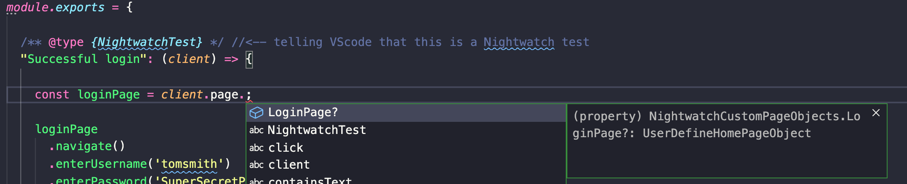
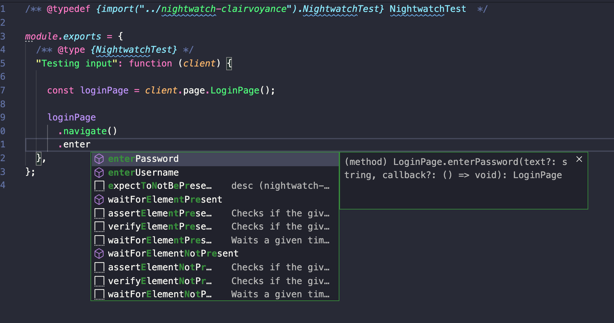

<h1 align="center">
	<br>
	
	<br>
	<br>
	<br>
</h1>

> Magical autocompletion for Nightwatch page objects 

This project is only a concept at the current state. 

As mentioned on their website
> Nightwatch.js is an integrated, easy to use End-to-End testing solution for web applications and websites, written in Node.js. It uses the W3C WebDriver API to drive browsers in order to perform commands and assertions on DOM elements.

While this is true since the framework comes with everything that you need out of the box to start your UI testing, you will soon realize that there are some things aren't so easy. 

These issues aren't necessarily an issue with the framework per say, but more on how you can get assistance from the text editor while writing your tests. 

This project is aiming to solve those problems to make using Nightwatch even easier for beginners or existing users/team who would like more assistance. 


### Idea/Concept

Automatically create types for Nightwatch page object that the user definitions and extend the base Nightwatch types with these. 

By doing this the user will know what page objects are available to them by simply typing `browser.page.` and the VScode would show a list of available pages.  

<h2 align="center">
	
	<br>
    <br>
</h2>

Also, the user should be able to know what methods are present on that instance of the page object and saying which elements can be user with `@<page-object-element>`.


<h2 align="center">
	
	<br>
    <br>
</h2>


### What is done so far? 

So currently the types for the LoginPage were created and manually added to `@types/nightwatch`, but in the test you will realize that we are referring the `./nightwatch-clairvoyance` file for the types. This is because I just copied the already created types and added to it. 

Is this is best way? I am not sure. Still very new to types so this is very hacky at the moment. 

```diff
+ /**
+ * Nightwatch Dynamic type definition by clairvoyance 
+ */

+ export interface LoginPage extends EnhancedPageObject {
+    enterUsername(text?: string, callback?: () => void): this;
+    enterPassword(text?: string, callback?: () => void): this;
+}

+ export type UserDefineLoginPageObject = () => LoginPage;

// tslint:disable-next-line
export interface NightwatchCustomPageObjects { 
+    LoginPage?: UserDefineLoginPageObject;
}

export type EnhancedPageObject<Commands = {}, Elements = {}, Sections extends EnhancedPageObjectSections = {}> = Nightwatch & SharedCommands & NightwatchCustomCommands & Commands & {
    /**
     * A map of Element objects (see [Enhanced Element Instances](https://github.com/nightwatchjs/nightwatch/wiki/Page-Object-API#enhanced-element-instances)) used by element selectors.
     */
    elements: {
        [name: string]: EnhancedElementInstance<EnhancedPageObject<Commands, Elements, Sections>>;
    };

+    // This is not complete yet
+    commands: Array<{
+        [name: string] : EnhancedCommandInstance
+    }>

    section: Sections;

    /**
     * The name of the page object as defined by its module name (not including the extension).
     * This is the same name used to access the `page` object factory from the page reference in the command API.
     */
    name: string;

    /**
     * This command is an alias to url and also a convenience method because when called without any arguments
     *  it performs a call to .url() with passing the value of `url` property on the page object.
     * Uses `url` protocol command.
     */
-	 navigate(url?: string, callback?: () => void): EnhancedPageObject<Commands, Elements, Sections>;
+    navigate(url?: string, callback?: () => void): EnhancedPageObject<Commands, Elements, Sections> & LoginPage;
};
```


### End Goal

I am seeing Nightwatch Clairvoyance as an extension for VScode that will provide autocompletion for Nightwatch and the user defined page objects. 

It will accomplish this by watching the `page_objects_path: [ 'pages' ]` files and generating types on the fly so the user can use them in their test as soon as the page object is saved. 

The workflow should be very minimal and the user shouldn't have to do anything too complicated to get it to work with their project. 

### Can you help? 

Yes, you can definitely! 

This will be my fist time creating a VS code extension, and I am just starting to use typescript so somethings are clear yet. 

So help is definitely welcomed! 

Contact me on [Twitter](https://twitter.com/irtimid_harding)

